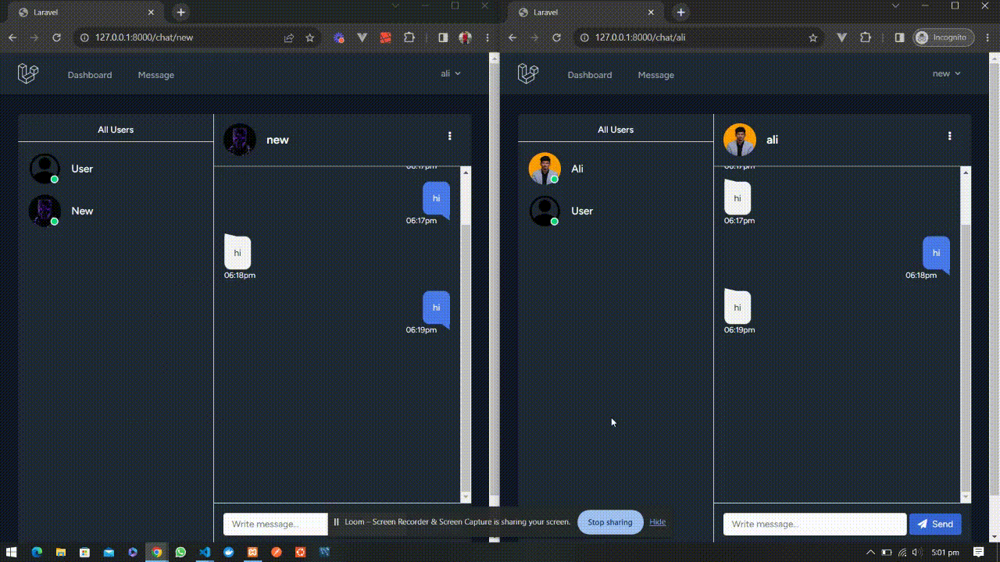

# Laravel Chat System

A chat system package for Laravel that enables users to chat with each other using Pusher PHP server. This Package provide you Echosystem ( Event , Controller , Migrations , Models , Views ) which enable your application to start conversatation between two users.

<div align="center">

[]()
[](https://github.com/alibinsarwar/chat-system/issues)
[](https://github.com/alibinsarwar/chat-system/pulls)

</div>

## Preview

[](preview/preview.mp4)

## Requirements

This package requires the following dependencies:

- User Authentication System ( Breeze , Jetstream , Custom )
- Pusher PHP server
- Pusher API keys and secret keys (obtained from your Pusher account)

## Features

- Communication through private channel
- Support Conversation Between two Users
- Dark Theme for Chat System

## Installation

1. Make sure you have a Pusher keys if you don't have then get them by login to [Pusher Dashboard](https://dashboard.pusher.com/) and then create new APP , and install [Pusher PHP Server](https://github.com/pusher/pusher-http-php) For authentication preffer to install [Laravel Breeze](https://github.com/laravel/breeze) package in your Laravel application.

2. Run the following command to install the Laravel Chat System package:

   ```shell
   composer require alisarwar/chat-system:dev-main
   ```

3. This package provide you Event , Controller , Migrations , Models , Views these things create an echo-system to implement chat system in you application

4. Add Routes to your web.php

   ```shell
    # veiw all available users to start conversation
       Route::get('/message',[MessageController::class , 'message'])->name('message');
    # open chat of specfic user
       Route::get('/chat/{slug?}',[MessageController::class , 'chat'])->name('chat');
    # broadcast message to channel
       Route::post('/broadcast', [MessageController::class , 'broadcast'])->name('broadcast');
    # receive message from channel
       Route::post('/receive', [MessageController::class , 'receive'])->name('receive');
    # authenticate private channel
       Route::post('/pusher/auth', [MessageController::class , 'auth'])->name('pusher.auth');
   ```

5. Update your .env

   ```shell
       BROADCAST_DRIVER=pusher

       PUSHER_APP_ID={YOUR_PUSHER_APP_ID}
       PUSHER_APP_KEY={YOUR_PUSHER_APP_KEY}
       PUSHER_APP_SECRET={YOUR_PUSHER_APP_SECRET}
       PUSHER_HOST=
       PUSHER_PORT=443
       PUSHER_SCHEME=https
       PUSHER_APP_CLUSTER={YOUR_PUSHER_APP_CLUSTER}
   ```

6. Migrate and Server Your Application

   ```shell
       php artisan migrate
       php artisan serve
   ```

7. Register Users and start conversation by going to /message

## Contributing

Contributions are welcome! If you encounter any issues or have suggestions for improvements, please open an issue or submit a pull request on the [GitHub repository](https://github.com/alibinsarwar/chat-system).
